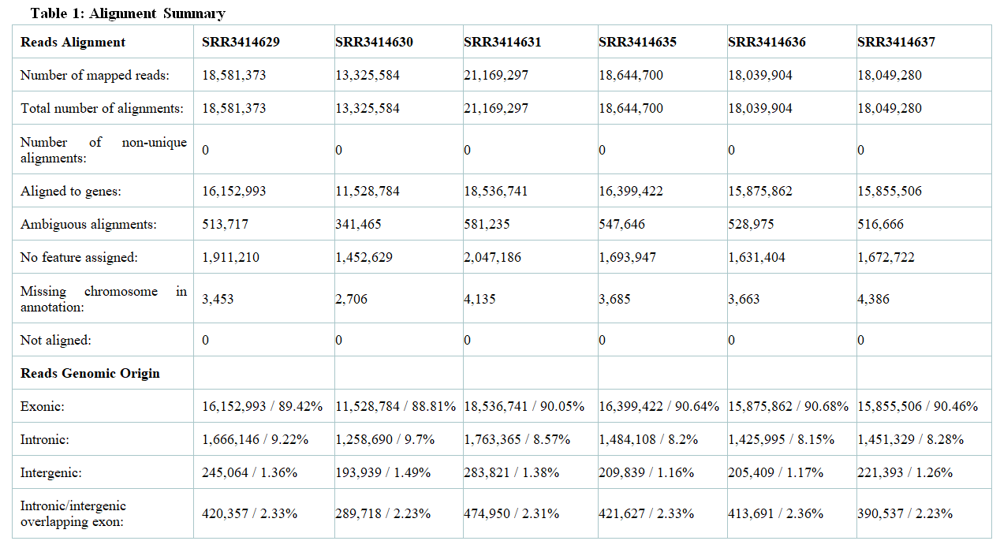
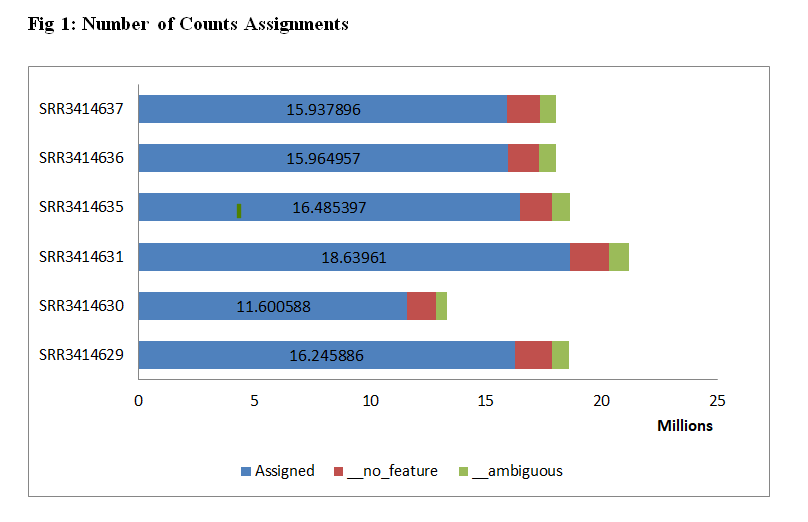
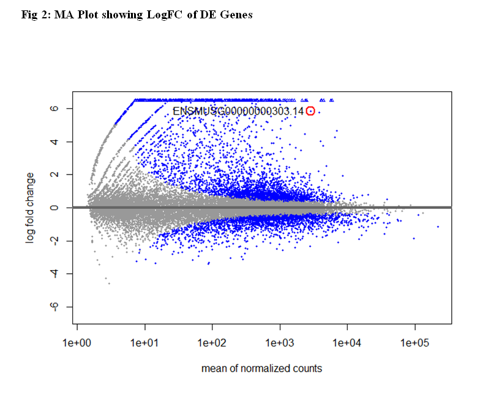
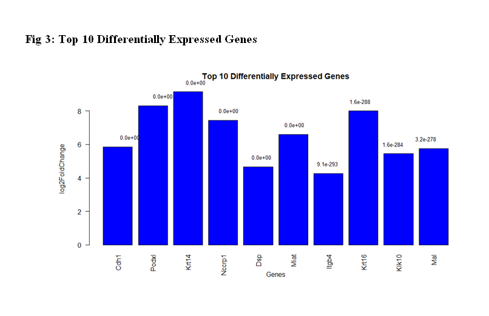
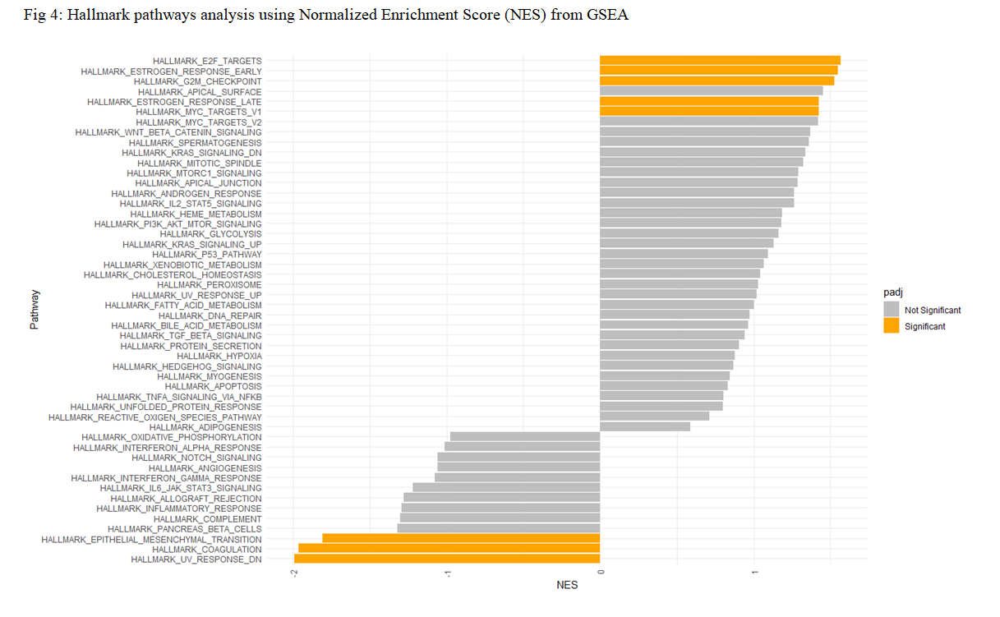

# RNA Sequence Analysis

## RNA-seq Analysis of Reprogrammed and non-Reprogrammed Somatic Cell

This directory contains the bioinformatic analysis of RNA-seq data from a mouse embryonic stem cell (ESC) reprogramming experiment. The analysis includes the alignment of raw RNA-seq data, generation of count data, differential expression analysis using DESeq2, and hallmark pathway analysis using Normalized Enrichment Score (NES) from GSEA. The data is based on the article "TRIM28 Is an Epigenetic Barrier to Induced Pluripotent Stem Cell Reprogramming" by Myles et al. ([link](http://dx.doi.org/10.1002/stem.2453)).

This project was submitted as part of the Bioinformatics Department's OMICS task 1 at the Moscow Institute of Physics and Technology (MIPT).

### Data Description

- **Date downloaded**: March 16th, 2024
- **Experiment**: RNA-sequencing (RNA-seq)
- **Analysis**: DEGs and GSEA
- **Organism**: Mouse
- **Cell lines**:
  - Reprogrammed (iPSCs):
    - SRR3414629
    - SRR3414630
    - SRR3414631
  - Non-reprogrammed (control) - mouse ESCs:
    - SRR3414635
    - SRR3414636
    - SRR3414637
- **Library type**: Stranded RNA-seq
- **Sequencing platform**: Illumina HiSeq 2500
- **Source**: Transcriptomic
- **Selection**: Poly(A) selected RNA
- **Layout**: Single-end
- **Construction protocol**:
  - Cells were harvested using standard procedures and RNA was extracted using Trizol reagent.
  - Illumina TruSeq RNA Sample Prep Kit (Cat#FC-122-1001) was used with 1 ug of total RNA for the construction of sequencing libraries.
  - RNA libraries were prepared for sequencing using standard Illumina protocols.

### Workflow

#### Quality Control
The FastQC report indicated by critical parameters such as sequence length distribution, per-sequence GC content, and adapter content pass the quality assessment, signifying their high quality 

#### Alignment Summary

#### Alignment QC
Filtered out reads with multiple alignments leaving only uniquely mapped reads for further analysis. I used this code to filter:
	*grep -P '^@|NH:i:1$' SRR3414636.sam > SRR3414636.uniq.sam*

#### Count Data

#### Differential Expression Analysis (DEG)

#### Hallmark Pathway Analysis

### Purpose

This analysis aims to investigate differential gene expression between reprogrammed and non-reprogrammed datasets. It also focuses on identifying pathways enriched with differentially expressed genes.

### Target Audience

This project is intended for researchers interested in RNA-seq analysis, differential gene expression, and enriched pathways analysis.

### Software

The analysis pipeline utilizes tools like HISAT2 for reads alignment, HTcount for counts aligned reads, DESeq2 for Differential Expression Analysis, and fgsea for Gene Set Expression Analysis.

### Scripts

Analysis scripts can be found in the respective subdirectory, with further explanations provided in the [detailed report](Jude_task1_corrected.pdf).

## Conclusion
This analysis underscores the importance of quality control measures and the use of alignment algorithms such as HISAT2 and BOWTIE2. It emphasizes the significance of normalization techniques for accurate gene expression analysis, including the manual calculation of RPKM using Chd1 as an example where normalization was done based on gene length and read depth. Through detailed analyses and visualizations, the study identifies statistically significant differentially expressed genes between conditions and explores potential pathways and biological processes associated with these genes.

